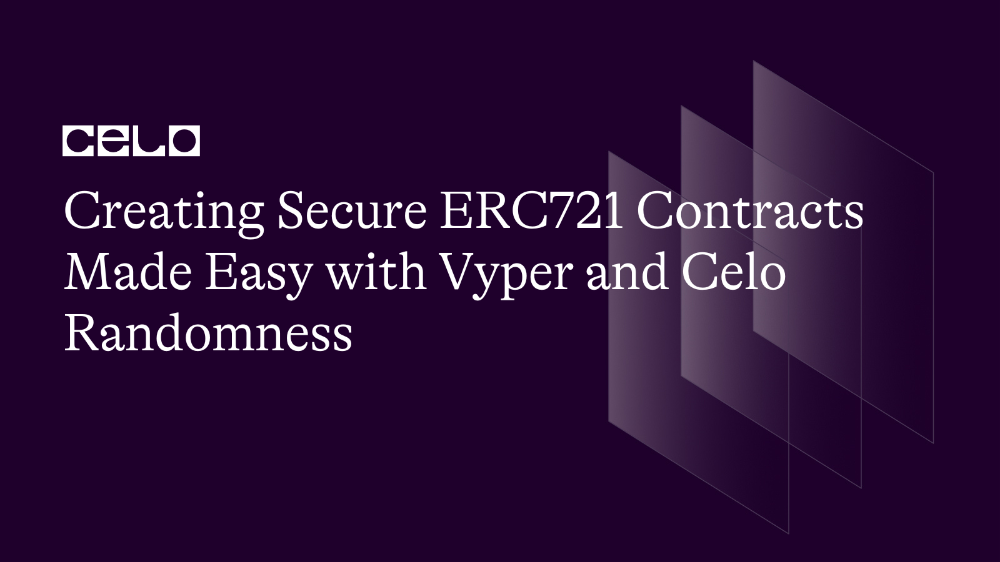
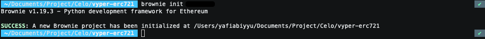
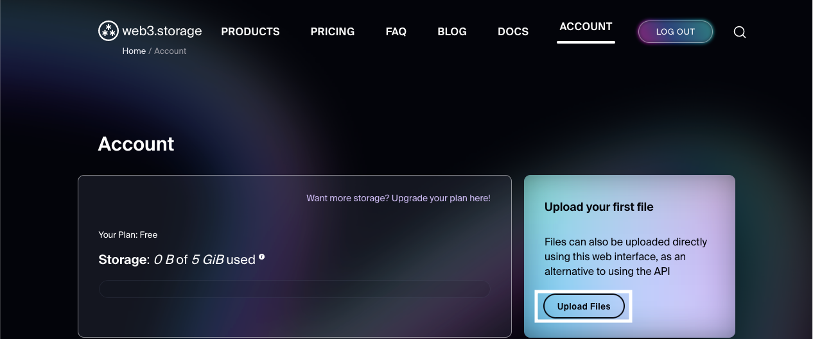
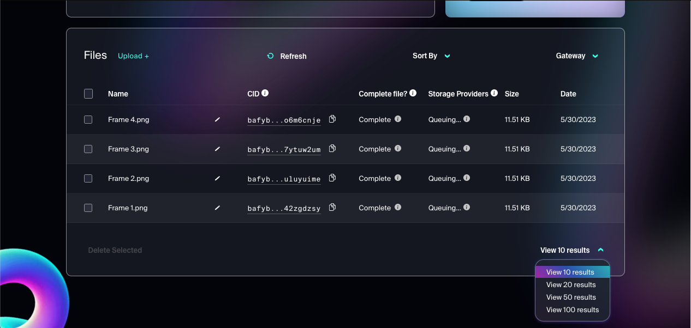

## Introduction

Vyper, an open-source programming language created specifically for building smart contracts on the Celo blockchain. Vyper aims to make it easier for developers to create smart contracts that are more secure and auditable. It is based on Python but has a simpler syntax and supports only a limited number of potentially risky Python features, such as dynamic typing, inheritance, and operator overloading. Vyper's main advantage is its focus on security, with features like strong typing, integer overflow protection, and gas cost estimation designed to prevent mistakes in smart contract development. Additionally, Vyper supports the ERC20, ERC721, and ERC777 smart contract standards. While still under active development, Vyper has gained popularity as a choice for developers seeking to build more secure and auditable smart contracts on the Celo blockchain.


## Prerequisites

Before starting the tutorial *Creating Secure ERC721 Contracts Made Easy with Vyper and Celo Randomness* make sure you meet the following prerequisites:

1. Have basic knowledge of blockchain and smart contracts.
2. Have experience using the terminal (command-line interface) on the operating system you are using.
3. Have knowledge of the Python programming language and a basic understanding of its syntax and code structure.
4. Have a registered Celo account on the Alfajores network with a balance to pay transaction fees.
5. Have an understanding of standard ERC721 smart contracts and how they are used to create unique assets.

Meeting these requirements is essential for proper understanding and optimal results.


## Requirements

- [Python3.6](https://www.python.org/downloads/release/python-368/) or greater
- [NodeJs](https://nodejs.org/en/) >= v14.0.0 and npm >= 6.12.0 (For Ganache)
- [Ganache](https://www.trufflesuite.com/ganache) (For local blockchain)
- [eth-brownie](https://eth-brownie.readthedocs.io/en/stable/install.html) (For development and testing smart contracts)
- [python-dotenv](https://pypi.org/project/python-dotenv/) (For loading environment variables from .env file)


This is a list of what we’ll cover 🗒

- ✅ **Step 1:** Project setup
- ✅ **Step 2:** Write contract
- ✅ **Step 3:** Upload Image to IPFS
- ✅ **Step 4:** Deploy & interact with contract


## **Step 1:** Project setup

let's create a new directory by running the following command in your terminal, and navigate into the project directory.

```bash
mkdir vyper-erc721 && cd vyper-erc721
```

Now, we need to install the required packages. This will install all the dependencies needed to run our project.

```bash
# install eth-brownie and python-dotenv
pip3 install eth-brownie python-dotenv

# install ganache
npm install -g ganache
```

To start the project, we need to initialize it using brownie. Open your terminal and enter the following command to initialize the project

```bash
brownie init
```

If successful, you will see output like this



To integrate Celo Network into Brownie, you must run a command in your terminal. This command will add Celo Network to Brownie and enable you to develop and test smart contracts on the Celo blockchain

```bash
# Celo Mainnet
brownie networks add Celo celo-mainnet host=https://forno.celo.org chainid=42220 explorer=https://explorer.celo.org

# Celo Alfajores Testnet
brownie networks add Celo celo-alfajores host=https://alfajores-forno.celo-testnet.org chainid=44787 explorer=https://alfajores-blockscout.celo-testnet.org
```

After successfully adding the Celo network to Brownie, you can view the list of added networks by running the following command in your terminal

```bash
brownie networks list
```

Next, we will create an `.env` file in the project root to store the environment variables that will be used in this project. Please populate the `.env` file with the following environment variables.

```bash
MNEMONIC="your_wallet_mnemonic"
```

Finally, we will create a `brownie-config.yaml` file to store the configuration for the deployment contract. Please create a `brownie-config.yaml` file in the root directory of the project, and ensure that it includes the following configuration.

```yaml
# brownie-config.yaml
project_structure:
    build: build
    contracts: contracts
    interfaces: interfaces
    reports: reports
    scripts: scripts
    tests: tests
compiler:
    vyper:
        version: 0.3.7
networks:
    default: celo-alfajores
console:
    show_colors: true
    color_style: monokai
    auto_suggest: true
    completions: true
    editing_mode: emacs
dotenv: .env
wallets:
    from_mnemonic: ${MNEMONIC}
```

## **Step 2:** Write contract

To create an ERC721 contract using Vyper, you will need to create a new file named `NFT.vy` in the `contracts` folder. The `NFT.vy` file will contain the code for your ERC721 contract.


### Write basic ERC721 contract

To create a basic ERC721 contract, we first need to define the Vyper version to use. Once we have done that, we can import the ERC721 & ERC165 module from the Vyper interface.

```python
# @version 0.3.7

from vyper.interfaces import ERC165
from vyper.interfaces import ERC721
```

Next, we will define the `ERC721Receiver` interface, which includes the `onERC721Received` function. This function will be called when an ERC721 token is transferred to the contract. The `onERC721Received` function can be used to do something with the token, such as minting it to an account or transferring it to another contract.

```python
interface ERC721Receiver:
    def onERC721Received(
        _operator: address,
        _from: address,
        _tokenId: uint256,
        _data: Bytes[1024]
    ) -> bytes4: nonpayable
```

Next, we will define the state variables and mappings that will be used in the ERC-721 contract.

```python
# State variable
_name: String[50]
_symbol: String[5]

SUPPORTED_INTERFACES: constant(bytes4[2]) = [
    0x01ffc9a7,
    0x80ac58cd
]

# Mapping
_owner: HashMap[uint256, address]
_balance: HashMap[address, uint256]
_tokenApprovals: HashMap[uint256, address]
_operatorApprovals: HashMap[address, HashMap[address, bool]]
```

Once we have defined the state variables and mappings, the next step is to define the events that will be emitted by the ERC-721 contract. Events are used to notify observers of changes to the contract state.

```python
event Transfer:
    sender: indexed(address)
    receiver: indexed(address)
    tokenId: uint256

event Approval:
    owner: indexed(address)
    spender: indexed(address)
    tokenId: uint256

event ApprovalForAll:
    owner: indexed(address)
    operator: indexed(address)
    approved: bool
```

Finally, we will define the functions to be used in the ERC721 contract. This section is not intended to be a comprehensive explanation of the functions, but rather a brief overview. For a more detailed explanation, please refer to the [EIP-721](https://eips.ethereum.org/EIPS/eip-721).

```python
@external
def __init__(name_: String[50], symbol_: String[5]):
    self._name = name_
    self._symbol = symbol_

@view
@external
def name() -> String[50]:
    return self._name

@view
@external
def symbol() -> String[5]:
    return self._symbol

@view
@external
def balanceOf(owner_: address) -> uint256:
    return self._balance[owner_]

@view
@external
def ownerOf(tokenId_: uint256) -> address:
    return self._ownerOf(tokenId_)

@view
@external
def getApproved(tokenId_: uint256) -> address:
    return self._tokenApprovals[tokenId_]

@view
@external
def isApprovedForAll(owner_: address, operator_: address) -> bool:
    return self._operatorApprovals[owner_][operator_]

@external
def approve(spender_: address, tokenId_: uint256):
    owner_: address = self._ownerOf(tokenId_)
    assert spender_ != empty(address), "ERC721: Approve to the zero address"
    assert spender_ != owner_, "ERC721: Approve to current owner"
    assert self._exist(tokenId_), "ERC721: Invalid token id"

    senderIsOwner: bool = self._ownerOf(tokenId_) == msg.sender
    senderIsApproved: bool = self._operatorApprovals[self._ownerOf(tokenId_)][msg.sender]
    assert senderIsOwner or senderIsApproved, "ERC721: Not owner or approved for all"
    self._tokenApprovals[tokenId_] = spender_
    log Approval(owner_, spender_, tokenId_)

@external
def setApprovalForAll(operator_: address, approved_: bool):
    assert operator_ != empty(address), "ERC721: Approve to the zero address"
    assert operator_ != msg.sender, "ERC721: Approve to caller"
    self._operatorApprovals[msg.sender][operator_] = approved_
    log ApprovalForAll(msg.sender, operator_, approved_)

@external
def transferFrom(from_: address, to_: address, tokenId_: uint256):
    self._transfer(from_, to_, msg.sender, tokenId_)

@external
def safeTransferFrom(from_: address, to_: address, tokenId_: uint256, data_: Bytes[1024]=b""):
    self._transfer(from_, to_, msg.sender, tokenId_)
    if to_.is_contract: # check if `_to` is a contract address
        returnValue: bytes4 = ERC721Receiver(to_).onERC721Received(msg.sender, from_, tokenId_, data_)
        # Throws if transfer destination is a contract which does not implement 'onERC721Received'
        assert returnValue == method_id("onERC721Received(address,address,uint256,bytes)", output_type=bytes4)

@pure
@external
def supportsInterface(interface_id: bytes4) -> bool:
    """
    @dev Interface identification is specified in ERC-165.
    @param interface_id Id of the interface
    """
    return interface_id in SUPPORTED_INTERFACES

@internal
def _transfer(from_: address, to_: address, sender_: address, tokenId_: uint256):
    assert self._exist(tokenId_), "ERC721: Invalid token id"
    assert to_ != empty(address), "ERC721: Transfer to the zero address"
    assert self._isApprovedOrOwner(sender_, tokenId_), "ERC721: Not owner or approved"

    self._balance[from_] -= 1
    self._balance[to_] += 1

    # Remove previous approvals
    if self._tokenApprovals[tokenId_] != empty(address):
        self._tokenApprovals[tokenId_] = empty(address)
    
    self._owner[tokenId_] = to_
    log Transfer(from_, to_, tokenId_)


@view
@internal
def _isApprovedOrOwner(spender_: address, tokenId_: uint256) -> bool:
    owner_: address = self._ownerOf(tokenId_)
    spenderIsOwner: bool = owner_ == spender_
    spenderIsApproved: bool = spender_ == self._tokenApprovals[tokenId_]
    spenderIsApprovedForAll: bool = self._operatorApprovals[owner_][spender_]
    return (spenderIsOwner or spenderIsApproved) or spenderIsApprovedForAll
@view
@internal
def _exist(tokenId_: uint256) -> bool:
    return self._owner[tokenId_] != empty(address)

@view
@internal
def _ownerOf(tokenId_: uint256) -> address:
    return self._owner[tokenId_]
```

### Customizing the ERC-721 contract

Now that we have created a basic ERC721 contract, we can add some additional features to meet our needs in this tutorial. We will create a ColorNFT with four different color collections, each with a different level of rarity. When a user mints, they will randomly receive one of those colors.

First, we will add an interface for the Celo Randomness smart contract. We will use this interface to interact with the Celo Randomness smart contract and retrieve a random number.

```python
interface ERC721Receiver:
    def onERC721Received(
        _operator: address,
        _from: address,
        _tokenId: uint256,
        _data: Bytes[1024]
    ) -> bytes4: nonpayable

# Celo Randomness smart contract interface
interface IRandom:
    def random() -> bytes32: view
```

Next, we will add new state variables and mappings to the ERC721 contract. Here is a list of the state variables and mappings that we will add:

- `_tokenURI`: This will be used to store the token URI for each token ID.

- `_rarityArray`: This will be used to store the rarity of each color.

- `_tokenCounter`: This will be used to store the total number of tokens minted.

- `_mintingFee`: This will be used to store the minting fee.

- `_devAddress`: This will be used to store the developer address.

- `_random`: This will be used to store the Celo Randomness smart contract address.

Here is the complete code:

```python
# State Variable

_name: String[50]
_symbol: String[5]
_tokenURI: DynArray[String[100], 4]
_rarityArray: DynArray[uint256, 4]
_tokenCounter: uint256
_mintingFee: uint256

_devAddress: address
_random: IRandom
SUPPORTED_INTERFACES: constant(bytes4[2]) = [
    0x01ffc9a7,
    0x80ac58cd
]

# Mapping

_owner: HashMap[uint256, address]
_balance: HashMap[address, uint256]
_tokenApprovals: HashMap[uint256, address]
_operatorApprovals: HashMap[address, HashMap[address, bool]]
_tokenIdToURI: HashMap[uint256, String[100]]
```

Next, we will add a TransferOwnership event. This event will be used to send information about when the ownership of an ERC721 token changes.

```python
event TransferOwnerShip:
    newOwner: indexed(address)
    oldOwner: indexed(address)

event Transfer:
    sender: indexed(address)
    receiver: indexed(address)
    tokenId: uint256

event Approval:
    owner: indexed(address)
    spender: indexed(address)
    tokenId: uint256

event ApprovalForAll:
    owner: indexed(address)
    operator: indexed(address)
    approved: bool
```

After adding a new state variable, we need to modify the constructor function to initialize the state variable.

```python
@external
def __init__(name_: String[50], symbol_: String[5], tokenURI_: DynArray[String[100], 4], rarityArray_: DynArray[uint256, 4], mintingFee_: uint256, random_: address):
    self._name = name_
    self._symbol = symbol_
    self._tokenURI = tokenURI_
    self._rarityArray = rarityArray_
    self._tokenCounter = 0
    self._mintingFee = mintingFee_
    self._devAddress = msg.sender
    self._random = IRandom(random_)
```

Next, we will create some new functionality for developers to configure ERC721 smart contracts. Here are the functions we will add:

- `claimFee()`

    The `claimFee` function allows the contract developer to claim any fees that have been collected.

- `updateFee()`

    The `updateFee` function is an important part of the contract. It allows the contract developer to control the minting fee.

- `transferOwnership()`

    The `transferOwnership` function allows the contract developer to transfer ownership of the contract to another party

- `getDev()`

    The `getDev` function allows anyone to verify who the current developer of the contract is

Here is the complete code:

```python
@external
def claimFee():
    assert msg.sender == self._devAddress, "Ownable: Only dev can call this function"
    amount: uint256 = self.balance
    send(self._devAddress, amount)

@external
def updateFee(mintingFee_: uint256):
    assert msg.sender == self._devAddress, "Ownable: Only dev can call this function"
    self._mintingFee = mintingFee_

@external
def transferOwnerShip(newOwner_: address):
    assert msg.sender == self._devAddress, "Ownable: Only dev can call this function"
    self._devAddress = newOwner_
    log TransferOwnerShip(newOwner_, msg.sender)

@view
@external
def getDev() -> address:
    return self._devAddress
```

Next, we will create three new internal functions. The following are the functions:

- `_setTokenURI()`

    The function _setTokenURI is an internal function that is used to set the URI for a token

- `_calculateRarity()`

    The function _calculateRarity is an internal function that is used to calculate the rarity of a token. The function then calculates the rarity of the token by using the following steps:
    
    1. Calculate the cumulative sum of the rarity array.
    2. Iterate over the rarity array.
    3. f the random number is greater than or equal to the cumulative sum and less than the current rarity value, then the rarity of the token is the current index.
    4. Update the cumulative sum to the current rarity value.
    5. Return the rarity of the token.

- `getRandomNumber()`

    This function is used to get a random number from the Celo Randomness smart contract.

Here is the complete code:

```python
@internal
def _setTokenURI(tokenId_: uint256, tokenURI_: String[100]):
    self._tokenIdToURI[tokenId_] = tokenURI_

@view
@internal
def _calculateRarity(randomNumber_: uint256) -> uint256:
    cumulativeSum: uint256 = 0
    rarity: uint256 = 0
    for i in range(4):
        if randomNumber_ >= cumulativeSum:
            if randomNumber_ < self._rarityArray[i]:
                rarity = i
        cumulativeSum = self._rarityArray[i]
    return rarity

@view
@internal
def _getRandomNumber() -> uint256:
    randomHash: bytes32 = keccak256(
        concat(blockhash(block.number - 15), self._random.random())
    )
    return convert(randomHash, uint256)
```

Next, we will create the last two functions, namely the mint function and the burn function. Here is the complete code:

```python
@external
@payable
def mint():
    assert msg.value == self._mintingFee, "ERC721: Insufficient fee"
    randomNumber: uint256 = self._getRandomNumber() % 100
    rarity: uint256 = self._calculateRarity(randomNumber)
    self._setTokenURI(self._tokenCounter, self._tokenURI[rarity])
    self._owner[self._tokenCounter] = msg.sender
    self._balance[msg.sender] += 1
    log Transfer(empty(address), msg.sender, self._tokenCounter)
    self._tokenCounter += 1


@external
def burn(tokenId_: uint256):
    assert self._isApprovedOrOwner(msg.sender, tokenId_), "ERC721: Not owner or approved"
    owner: address = self._ownerOf(tokenId_)
    assert owner != empty(address), "ERC721: Invalid token id"
    self._balance[owner] -= 1
    self._owner[tokenId_] = empty(address)
    self._tokenApprovals[tokenId_] = empty(address)
    log Transfer(msg.sender, empty(address), tokenId_)
```

- `mint()`

    The `mint` function mints a new token on the blockchain. It checks the user's minting fee and generates a random number to determine the token's rarity. The function then sets the owner of the token and increments the user's balance. It logs a Transfer event and increments the token counter.

- `burn()`

    The `burn` function burns a token on the blockchain. It checks the user's ownership and decrements the user's balance. It sets the owner and approval to empty addresses and logs a Transfer event. In other words, the burn() function removes a token from circulation by setting the token's owner and approval to empty addresses. This makes the token unspendable and effectively removes it from the blockchain.

We have completed the creation of the ERC-721 contract. Here is the complete code for the ERC-721 contract we have created.

```python
# @dev Implementation of ERC-721 non-fungible token standard.
# @author Abiyyu Yafi (@yafiabiyyu)
# Modified from: https://github.com/vyperlang/vyper/blob/de74722bf2d8718cca46902be165f9fe0e3641dd/examples/tokens/ERC721.vy

# @version 0.3.7

from vyper.interfaces import ERC165
from vyper.interfaces import ERC721


# Define Interface

interface ERC721Receiver:
    def onERC721Received(
        _operator: address,
        _from: address,
        _tokenId: uint256,
        _data: Bytes[1024]
    ) -> bytes4: nonpayable

interface IRandom:
    def random() -> bytes32: view


# Define State Variables

_name: String[50]
_symbol: String[5]
_tokenURI: DynArray[String[100], 4]
_rarityArray: DynArray[uint256, 4]
_tokenCounter: uint256
_mintingFee: uint256

_devAddress: address
_random: IRandom
SUPPORTED_INTERFACES: constant(bytes4[2]) = [
    0x01ffc9a7,
    0x80ac58cd
]


# Define Mappings

_owner: HashMap[uint256, address]
_balance: HashMap[address, uint256]
_tokenApprovals: HashMap[uint256, address]
_operatorApprovals: HashMap[address, HashMap[address, bool]]
_tokenIdToURI: HashMap[uint256, String[100]]


# Define Events

event TransferOwnerShip:
    newOwner: indexed(address)
    oldOwner: indexed(address)

event Transfer:
    sender: indexed(address)
    receiver: indexed(address)
    tokenId: uint256

event Approval:
    owner: indexed(address)
    spender: indexed(address)
    tokenId: uint256

event ApprovalForAll:
    owner: indexed(address)
    operator: indexed(address)
    approved: bool


@external
def __init__(name_: String[50], symbol_: String[5], tokenURI_: DynArray[String[100], 4], rarityArray_: DynArray[uint256, 4], mintingFee_: uint256, random_: address):
    self._name = name_
    self._symbol = symbol_
    self._tokenURI = tokenURI_
    self._rarityArray = rarityArray_
    self._tokenCounter = 0
    self._mintingFee = mintingFee_
    self._devAddress = msg.sender
    self._random = IRandom(random_)


# Define Dev Function

@external
def claimFee():
    assert msg.sender == self._devAddress, "Ownable: Only dev can call this function"
    amount: uint256 = self.balance
    send(self._devAddress, amount)

@external
def updateFee(mintingFee_: uint256):
    assert msg.sender == self._devAddress, "Ownable: Only dev can call this function"
    self._mintingFee = mintingFee_

@external
def transferOwnerShip(newOwner_: address):
    assert msg.sender == self._devAddress, "Ownable: Only dev can call this function"
    self._devAddress = newOwner_
    log TransferOwnerShip(newOwner_, msg.sender)

@view
@external
def getDev() -> address:
    return self._devAddress


# Define ERC721 Functions

@view
@external
def name() -> String[50]:
    return self._name

@view
@external
def symbol() -> String[5]:
    return self._symbol

@view
@external
def balanceOf(owner_: address) -> uint256:
    return self._balance[owner_]

@view
@external
def ownerOf(tokenId_: uint256) -> address:
    return self._ownerOf(tokenId_)

@view
@external
def getTokenURI(tokenId_: uint256) -> String[100]:
    assert self._exist(tokenId_), "ERC721: Invalid token id"
    return self._tokenIdToURI[tokenId_]

@view
@external
def getApproved(tokenId_: uint256) -> address:
    return self._tokenApprovals[tokenId_]

@view
@external
def isApprovedForAll(owner_: address, operator_: address) -> bool:
    return self._operatorApprovals[owner_][operator_]

@view
@external
def fee() -> uint256:
    return self._mintingFee

@external
@payable
def mint():
    assert msg.value == self._mintingFee, "ERC721: Insufficient fee"
    randomNumber: uint256 = self._getRandomNumber() % 100
    rarity: uint256 = self._calculateRarity(randomNumber)
    self._setTokenURI(self._tokenCounter, self._tokenURI[rarity])
    self._owner[self._tokenCounter] = msg.sender
    self._balance[msg.sender] += 1
    log Transfer(empty(address), msg.sender, self._tokenCounter)
    self._tokenCounter += 1


@external
def burn(tokenId_: uint256):
    assert self._isApprovedOrOwner(msg.sender, tokenId_), "ERC721: Not owner or approved"
    owner: address = self._ownerOf(tokenId_)
    assert owner != empty(address), "ERC721: Invalid token id"
    self._balance[owner] -= 1
    self._owner[tokenId_] = empty(address)
    self._tokenApprovals[tokenId_] = empty(address)
    log Transfer(msg.sender, empty(address), tokenId_)

@external
def approve(spender_: address, tokenId_: uint256):
    owner_: address = self._ownerOf(tokenId_)
    assert spender_ != empty(address), "ERC721: Approve to the zero address"
    assert spender_ != owner_, "ERC721: Approve to current owner"
    assert self._exist(tokenId_), "ERC721: Invalid token id"

    senderIsOwner: bool = self._ownerOf(tokenId_) == msg.sender
    senderIsApproved: bool = self._operatorApprovals[self._ownerOf(tokenId_)][msg.sender]
    assert senderIsOwner or senderIsApproved, "ERC721: Not owner or approved for all"
    self._tokenApprovals[tokenId_] = spender_
    log Approval(owner_, spender_, tokenId_)

@external
def setApprovalForAll(operator_: address, approved_: bool):
    assert operator_ != empty(address), "ERC721: Approve to the zero address"
    assert operator_ != msg.sender, "ERC721: Approve to caller"
    self._operatorApprovals[msg.sender][operator_] = approved_
    log ApprovalForAll(msg.sender, operator_, approved_)

@external
def transferFrom(from_: address, to_: address, tokenId_: uint256):
    self._transfer(from_, to_, msg.sender, tokenId_)

@external
def safeTransferFrom(from_: address, to_: address, tokenId_: uint256, data_: Bytes[1024]=b""):
    self._transfer(from_, to_, msg.sender, tokenId_)
    if to_.is_contract: # check if `_to` is a contract address
        returnValue: bytes4 = ERC721Receiver(to_).onERC721Received(msg.sender, from_, tokenId_, data_)
        # Throws if transfer destination is a contract which does not implement 'onERC721Received'
        assert returnValue == method_id("onERC721Received(address,address,uint256,bytes)", output_type=bytes4)

@pure
@external
def supportsInterface(interface_id: bytes4) -> bool:
    """
    @dev Interface identification is specified in ERC-165.
    @param interface_id Id of the interface
    """
    return interface_id in SUPPORTED_INTERFACES

@internal
def _setTokenURI(tokenId_: uint256, tokenURI_: String[100]):
    self._tokenIdToURI[tokenId_] = tokenURI_

@view
@internal
def _calculateRarity(randomNumber_: uint256) -> uint256:
    cumulativeSum: uint256 = 0
    rarity: uint256 = 0
    for i in range(4):
        if randomNumber_ >= cumulativeSum:
            if randomNumber_ < self._rarityArray[i]:
                rarity = i
        cumulativeSum = self._rarityArray[i]
    return rarity

@view
@internal
def _getRandomNumber() -> uint256:
    randomHash: bytes32 = keccak256(
        concat(blockhash(block.number - 15), self._random.random())
    )
    return convert(randomHash, uint256)

@internal
def _transfer(from_: address, to_: address, sender_: address, tokenId_: uint256):
    assert self._exist(tokenId_), "ERC721: Invalid token id"
    assert to_ != empty(address), "ERC721: Transfer to the zero address"
    assert self._isApprovedOrOwner(sender_, tokenId_), "ERC721: Not owner or approved"

    self._balance[from_] -= 1
    self._balance[to_] += 1

    # Remove previous approvals
    if self._tokenApprovals[tokenId_] != empty(address):
        self._tokenApprovals[tokenId_] = empty(address)
    
    self._owner[tokenId_] = to_
    log Transfer(from_, to_, tokenId_)


@view
@internal
def _isApprovedOrOwner(spender_: address, tokenId_: uint256) -> bool:
    owner_: address = self._ownerOf(tokenId_)
    spenderIsOwner: bool = owner_ == spender_
    spenderIsApproved: bool = spender_ == self._tokenApprovals[tokenId_]
    spenderIsApprovedForAll: bool = self._operatorApprovals[owner_][spender_]
    return (spenderIsOwner or spenderIsApproved) or spenderIsApprovedForAll
@view
@internal
def _exist(tokenId_: uint256) -> bool:
    return self._owner[tokenId_] != empty(address)

@view
@internal
def _ownerOf(tokenId_: uint256) -> address:
    return self._owner[tokenId_]
```

## **Step 3:** Upload Image to IPFS

At this stage, we will upload image assets to be used as NFTs to IPFS. We will use IPFS as a repository for image data that will be used as NFTs. We will use an IPFS service provider platform called *Web3.Storage*.

1. Register an account on [Web3.Storage](https://web3.storage/). You can use your GitHub account to register.

2. After registering, you will be redirected to the dashboard page. Click **Upload Files** to upload your files.

    

3. After uploading the image, you will see the CID of the image that has been uploaded. Copy the CID of the image that has been uploaded.

    

4. Save the CID of the image. It will be used in the next step.

## **Step 4:** Deploy & interact with contract

This is the final step in this tutorial. In this step, we will deploy and interact with the contracts we created in the previous steps. To do this, we will create a new file named `deploy.py` in the `scripts` folder. This file will contain the code that we need to deploy the contracts and interact with them.

The deploy.py file should contain the following code:

```python
from brownie import accounts, config, network, NFT, web3


def get_account():
    if network.show_active() == "development":
        return accounts
    else:
        return accounts.from_mnemonic(config["wallets"]["from_mnemonic"], count=5)


def main():
    account = get_account()
    token_name = "Color Random NFT"
    token_symbol = "CRNFT"
    token_uri = [
        "https://bafyb.....",
        "https://bafyb.....",
        "https://bafyb.....",
        "https://bafyb.....",
    ]
    token_rarity = [5, 20, 50, 100]
    minting_fee = web3.toWei(0.1, "ether")
    celo_randomness = "0xdd318EEF001BB0867Cd5c134496D6cF5Aa32311F"

    contract = NFT.deploy(
        token_name,
        token_symbol,
        token_uri,
        token_rarity,
        minting_fee,
        celo_randomness,
        {
            "from": account[0]
        }
    )

    contract.tx.wait(2)

    # Mint tokens
    txMinting = contract.mint({"from": account[0], "value": minting_fee})
    txMinting.wait(2)

    # Transfer tokens
    txTransfer = contract.transferFrom(account[0].address, account[1].address, 0, {"from": account[0]})
```

In the code snippet above, there are a few things to note:

- `token_uri`: is an array containing the CIDs of the images that were uploaded to IPFS in the previous step. This array will be used to store the CID of the image that will be used as an NFT.

- `token_rarity`: The rarity array is an array that contains the rarity value of each NFT. This array will be used to store the rarity value of each NFT. The rarity value is calculated based on a number of factors, including the number of NFTs in the collection, the rarity of the individual traits, and the overall demand for the collection.

The `token_name`, `token_symbol`, and `minting_fee` can be filled in according to your wishes.

After that, we can run the script by running the following command in the terminal:

```bash
brownie run scripts/deploy.py --network celo-alfajores
```

## Conclusion

Vyper is a great choice for developers who are new to smart contract development. It's also a good choice for developers who want to create more secure smart contracts. Here are some of the benefits of using Vyper that I've experienced:

- *Security*: Vyper is a very secure language. It has a number of features that help to prevent mistakes in smart contract development, which can lead to security vulnerabilities. These features include: 
    - Strong typing: Vyper variables must all have a specified type. This helps to prevent errors such as accidentally passing a string to a function that expects an integer.

    - Integer overflow protection: Vyper prevents integer overflow errors, which can cause smart contracts to crash or behave unexpectedly.

    - Gas cost estimation: Vyper can estimate the gas cost of any function call. This helps developers to avoid running out of gas, which can also cause smart contracts to crash.

- *Ease of use*: Vyper is a very easy language to use. It has a simpler syntax than Solidity, and it has a smaller feature set. This makes it easier for developers to learn and use.

- *Community support*: The Vyper community is very active and helpful. There are a number of resources available to help developers learn Vyper, and there are a number of people who are willing to help developers with their Vyper projects.

## Next Step

Start building your own smart contracts. The best way to learn Vyper is by using it. There are a number of tutorials and examples available online, so you can get started right away. You can also check out the Vyper [documentation](https://docs.vyperlang.org/en/stable/structure-of-a-contract.html) for more information.

## About the Author

I am a blockchain and crypto enthusiast. I am also a software engineer. I love to learn new things and share my knowledge with others. You can find me on [GitHub](https://github.com/yafiabiyyu) and [LinkedIn](https://www.linkedin.com/in/abiyyuyafi/).

## References

- [Vyper Documentation](https://docs.vyperlang.org/en/stable/structure-of-a-contract.html)
- [Code Repository](https://github.com/yafiabiyyu/vyper-tutorial-code)